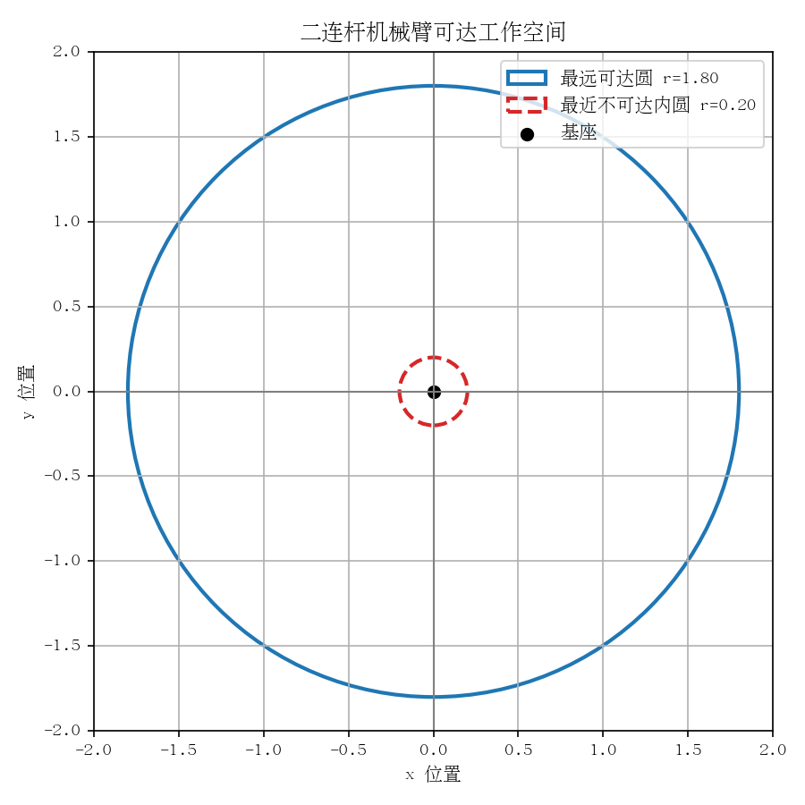
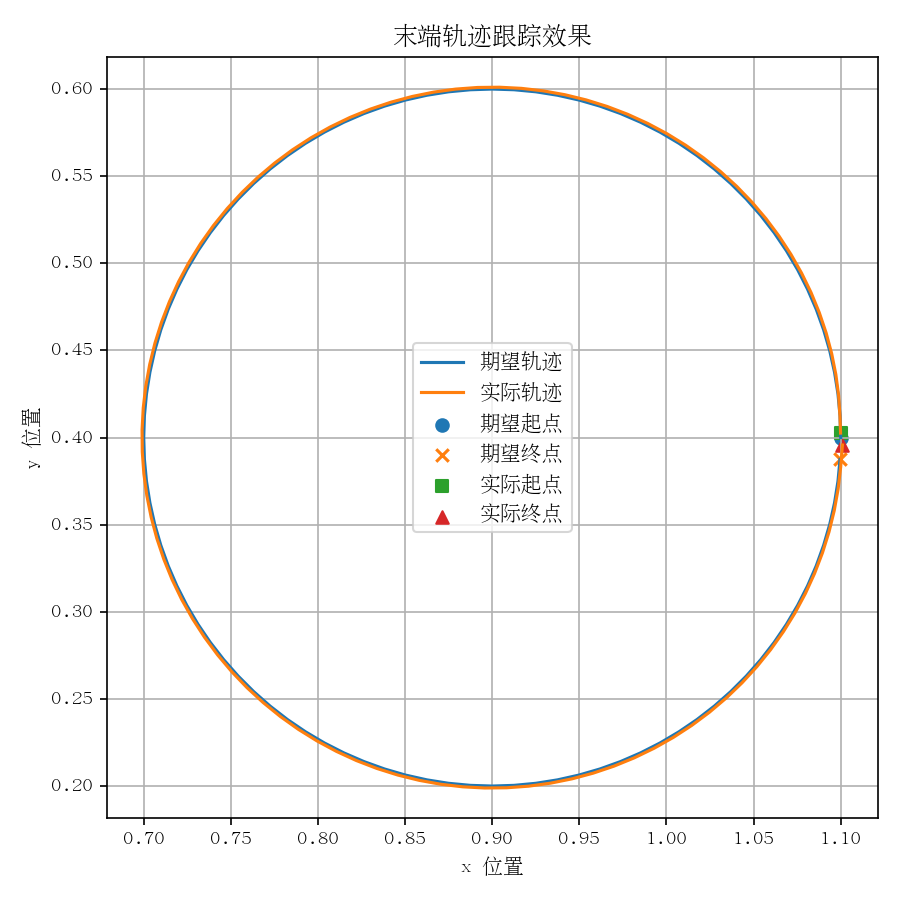
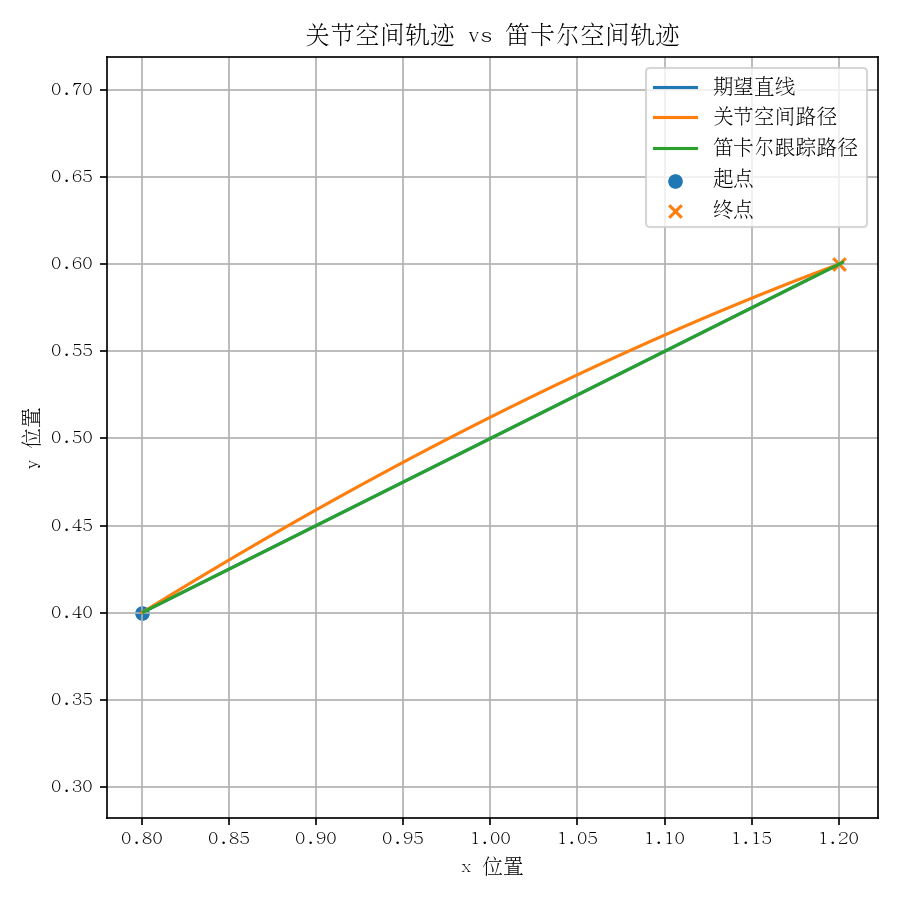
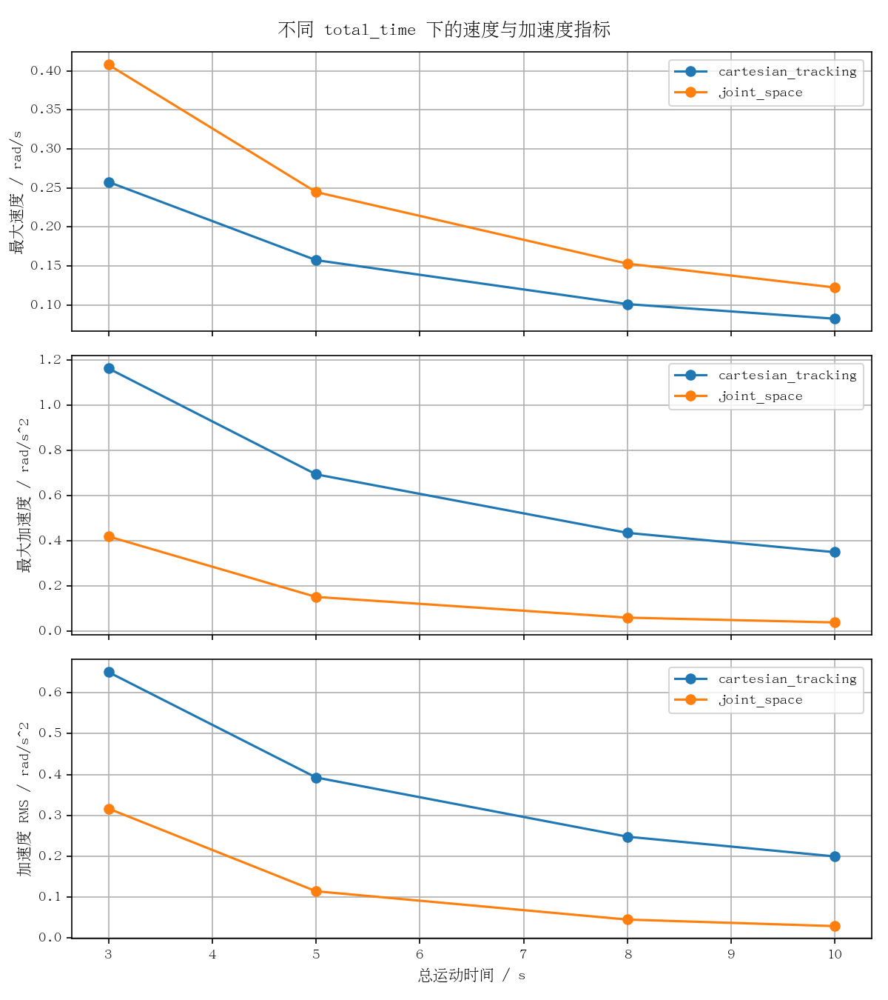

# robot_arm_target_control_study

这是一个面向机器人算法入门的 2D 二连杆机械臂运动学控制与轨迹规划实验项目。

项目目标不是搭建复杂仿真平台，而是做一个能运行、能改参数、能看懂数据流、能解释实验现象、适合写进 GitHub 和简历的学习项目。当前不使用 MuJoCo、ROS、强化学习、复杂动力学或三维机械臂。

## 项目亮点

- 实现 2D 二连杆机械臂正运动学，能计算基座、肘关节和末端位置。
- 实现解析逆运动学，用几何方法直接求解简单二连杆目标点。
- 实现雅可比伪逆迭代控制，把末端误差转换为关节角更新。
- 实现阻尼最小二乘控制，用于观察接近奇异位形时的数值稳定性。
- 支持 `gain`、`max_step`、`damping` 参数敏感性实验。
- 支持 resolved-rate 轨迹跟踪，对比 P、P+前馈和 PD 控制思想。
- 对比关节空间轨迹与笛卡尔空间轨迹，并分析速度/加速度约束。
- 输出 CSV、Matplotlib 图像，并提供 pytest 测试。

## 快速开始

```bash
pip install -r requirements.txt
python scripts/run_reach_demo.py --target_x 1.2 --target_y 0.6
pytest
```

运行目标点 demo 后，程序会打印目标点、最终末端位置、最终误差、是否到达目标附近，并输出姿态图、误差曲线和关节角曲线。

## 推荐运行命令

这 5 个命令最适合快速展示项目能力：

```bash
python scripts/run_reach_demo.py --target_x 1.2 --target_y 0.6
python scripts/run_compare_methods.py --target_x 1.2 --target_y 0.6
python scripts/run_trajectory_tracking_demo.py --trajectory circle --controller p_ff
python scripts/run_trajectory_space_compare.py --method quintic --total_time 5.0
python scripts/run_time_scaling_sweep.py
```

## 示例结果

工作空间图：



目标点控制误差曲线：


轨迹跟踪路径图：



关节空间 vs 笛卡尔空间路径对比：



total_time 轨迹重定时指标图：



## 输出结果说明

主要输出目录：

- `outputs/figures/`：保存工作空间图、误差曲线、轨迹跟踪图、轨迹空间对比图和 total_time 扫描图。
- `outputs/logs/`：保存参数扫描、轨迹空间对比、total_time 扫描等 CSV 指标。
- `docs/assets/`：保存 README 首页展示图，避免每次运行 demo 时覆盖首页展示材料。

常见输出文件：

- `outputs/arm_pose.png`：目标点控制后的机械臂最终姿态图。
- `outputs/error_curve.png`：目标点控制误差曲线。
- `outputs/joint_curve.png`：目标点控制关节角曲线。
- `outputs/figures/workspace.png`：二连杆机械臂工作空间图。
- `outputs/logs/parameter_sweep.csv`：参数扫描实验结果表。
- `outputs/figures/pinv_vs_damped_error.png`：普通伪逆和阻尼伪逆误差对比。
- `outputs/figures/trajectory_tracking_path.png`：期望轨迹和实际轨迹路径对比。
- `outputs/figures/trajectory_space_path_compare.png`：关节空间和笛卡尔空间路径对比。
- `outputs/logs/trajectory_space_compare.csv`：轨迹空间对比指标。
- `outputs/logs/time_scaling_sweep.csv`：不同 `total_time` 下的约束和轨迹指标。
- `outputs/figures/time_scaling_metric_summary.png`：速度、加速度和加速度 RMS 汇总图。

## 学习路线

建议按下面顺序学习和运行：

```text
目标点控制
-> 解析 IK 与雅可比迭代对比
-> 参数敏感性实验
-> 阻尼伪逆与奇异位形
-> resolved-rate 轨迹跟踪
-> 关节空间 vs 笛卡尔空间轨迹
-> 速度/加速度约束分析
-> total_time 轨迹重定时
```

## 文档入口

- [docs/README.md](docs/README.md)：docs 目录导航和推荐阅读顺序。
- [docs/15_experiment_summary.md](docs/15_experiment_summary.md)：实验现象、解释和项目结论汇总。
- [docs/16_resume_description.md](docs/16_resume_description.md)：简历短版、详细版和面试讲解版本。

## 项目结构

```text
robot_arm_target_control_study/
├── README.md
├── requirements.txt
├── scripts/
│   ├── run_reach_demo.py
│   ├── run_compare_methods.py
│   ├── run_parameter_sweep.py
│   ├── run_damped_jacobian_demo.py
│   ├── run_singularity_demo.py
│   ├── run_trajectory_tracking_demo.py
│   ├── run_trajectory_space_compare.py
│   └── run_time_scaling_sweep.py
├── src/
│   └── robot_arm_target_control_study/
│       ├── controller.py
│       ├── kinematics.py
│       ├── plotting.py
│       ├── simulation.py
│       ├── tracking_controller.py
│       ├── trajectory.py
│       └── utils.py
├── tests/
│   ├── test_controller.py
│   ├── test_kinematics.py
│   ├── test_trajectory.py
│   └── test_trajectory_metrics.py
├── docs/
│   ├── README.md
│   ├── 15_experiment_summary.md
│   ├── 16_resume_description.md
│   └── assets/
└── outputs/
    ├── figures/
    └── logs/
```

## 核心算法解释

二连杆机械臂有两个关节角：

- `theta1`：第一根连杆相对世界坐标系的角度。
- `theta2`：第二根连杆相对第一根连杆的角度。

正运动学回答的问题是：

> 已知关节角，末端在哪里？

解析逆运动学回答的问题是：

> 已知目标点，能不能通过几何公式直接算出关节角？

雅可比矩阵回答的问题是：

> 关节角变化一点点，末端会往哪个方向动？

项目中的雅可比伪逆控制可以简单理解为：

```text
关节角更新量 = 雅可比伪逆 * 末端误差
```

数据流可以概括为：

```text
命令行输入参数
-> 生成目标点或期望轨迹
-> 正运动学计算当前末端位置
-> 控制器计算关节角或关节速度更新
-> 记录误差、关节角、速度、加速度
-> 输出 CSV 和图像
```

## 阶段说明

### 1. 目标点控制

运行：

```bash
python scripts/run_reach_demo.py --target_x 1.2 --target_y 0.6
```

程序通过正运动学、雅可比矩阵和雅可比伪逆迭代控制，让机械臂末端逐步靠近目标点。阅读结果时不要只看 `final_error`，还要看误差曲线和关节角曲线。

### 2. 解析逆运动学与雅可比伪逆对比

运行：

```bash
python scripts/run_compare_methods.py --target_x 1.2 --target_y 0.6
```

解析逆运动学适合二连杆这类几何关系清楚的结构，可以直接求解关节角。雅可比伪逆迭代更通用，更接近高自由度机械臂常用的数值控制思想。

### 3. 参数敏感性、阻尼伪逆与奇异位形

运行：

```bash
python scripts/run_parameter_sweep.py --target_x 1.2 --target_y 0.6
python scripts/run_damped_jacobian_demo.py --target_x 1.75 --target_y 0.05
python scripts/run_singularity_demo.py
```

`gain` 会影响每次修正的积极程度，`max_step` 会限制单次关节变化，`damping` 会让接近奇异位形时的更新更保守。阻尼伪逆通常更稳定，但阻尼过大也可能让动作过慢。

### 4. resolved-rate 轨迹跟踪

运行：

```bash
python scripts/run_trajectory_tracking_demo.py --trajectory line --controller p_ff
python scripts/run_trajectory_tracking_demo.py --trajectory circle --controller p_ff
python scripts/run_trajectory_tracking_demo.py --trajectory line --controller pd --kd 0.02
```

轨迹跟踪不是简单连续追多个目标点。当前脚本先生成期望位置和期望速度，再用 resolved-rate 控制把末端速度命令转换成关节速度。P+前馈在当前简化运动学模型中表现稳定，PD 的速度误差项对离散速度估计较敏感。

### 5. 关节空间轨迹 vs 笛卡尔空间轨迹

运行：

```bash
python scripts/run_trajectory_space_compare.py
python scripts/run_trajectory_space_compare.py --start_x 0.8 --start_y 0.4 --goal_x 1.2 --goal_y 0.6 --method quintic
```

关节空间轨迹直接在 `theta1/theta2` 上插值，关节角、速度和加速度通常更平滑，但末端路径不一定是直线。笛卡尔空间轨迹能更好控制末端路径形状，但可能让关节速度和加速度更复杂。

### 6. 约束感知轨迹与 total_time 重定时

运行：

```bash
python scripts/run_trajectory_space_compare.py --method quintic --total_time 5.0
python scripts/run_time_scaling_sweep.py
python scripts/run_time_scaling_sweep.py --total_times 3 5 8 10
```

速度和加速度约束用于判断轨迹是否更可能被真实关节执行。`total_time` 表示整条轨迹希望用多少秒完成，同一路径走得更慢，通常能降低最大关节速度和最大关节加速度。

## 运行测试

```bash
pytest
```

测试重点：

- 正运动学是否正确。
- 解析逆运动学是否能回代到目标点。
- 可达目标点是否能收敛。
- 不可达目标点是否不会导致程序崩溃。
- 阻尼雅可比控制输出是否合理，并能降低误差。
- 轨迹生成、轨迹速度估计和轨迹跟踪 history 是否正确。
- 时间缩放、关节空间轨迹、离散速度和轨迹空间对比指标是否正确。
- 约束检查、路径偏差、真实时间轴和 total_time 扫描是否正确。

## 项目边界

当前项目只做：

- 2D 平面二连杆机械臂。
- 运动学层面的目标点控制和轨迹跟踪。
- 解析逆运动学、雅可比伪逆、阻尼伪逆教学实验。
- 参数扫描、误差曲线、关节曲线、速度/加速度指标输出。

当前不包含：

- MuJoCo。
- ROS。
- 真实机械臂。
- 动力学控制。
- 强化学习。
- 三维机械臂。
- 障碍物避障、接触、摩擦、电机和力矩模型。

## 后续可改进方向

- 给参数扫描增加更多目标点和初始姿态组合。
- 支持更多命令行参数，例如连杆长度、初始关节角和迭代参数。
- 增加简单动画，展示机械臂逐步靠近目标点或跟踪轨迹的过程。
- 继续补充奇异值分解视角下的阻尼最小二乘解释。
- 在保持当前运动学 demo 清晰的基础上，再考虑更复杂的仿真或硬件方向。
