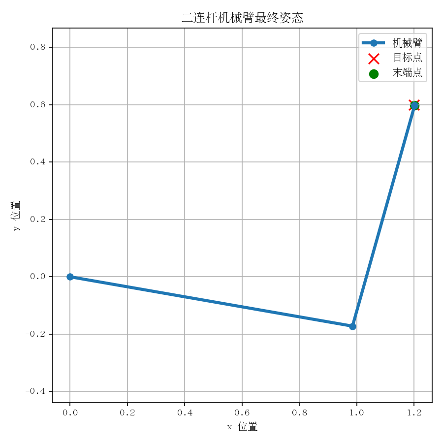
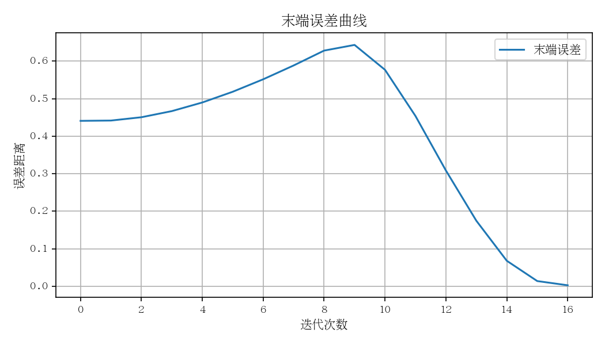
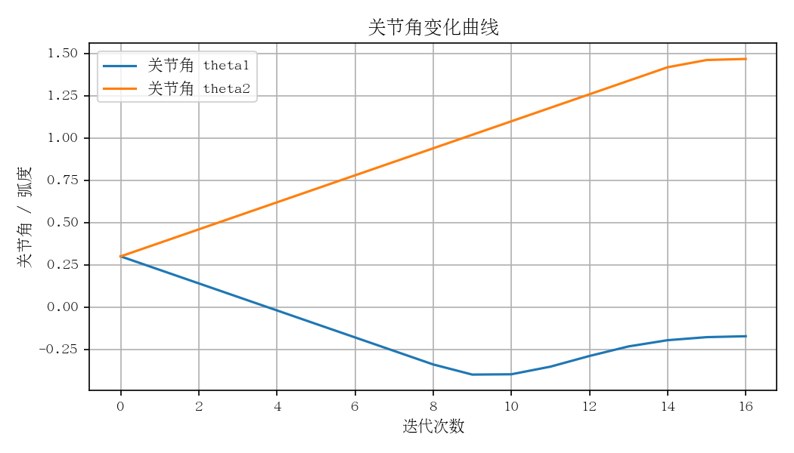

# robot_arm_target_control_study

这是一个面向机器人算法入门的 2D 平面二连杆机械臂目标点控制 demo。

第一阶段不使用 MuJoCo、ROS 或强化学习框架，只完成一个可以运行、可以测试、可以解释的小项目：用户输入目标点，程序通过正运动学、雅可比矩阵和雅可比伪逆迭代控制，让机械臂末端逐步靠近目标点。

## 功能特点

- 2D 平面二连杆机械臂建模。
- 使用正运动学计算基座、肘关节和末端执行器位置。
- 使用雅可比伪逆将末端误差转换为关节角更新量。
- 支持解析逆运动学与雅可比伪逆迭代控制对比。
- 支持参数扫描、阻尼雅可比控制和接近奇异位形实验。
- 支持命令行输入目标点。
- 自动输出最终姿态图、误差曲线、关节角变化曲线和实验对比曲线。
- 提供 pytest 测试，覆盖正运动学、解析逆运动学、可达目标收敛、阻尼控制和通用仿真历史。

## 示例结果

机械臂最终姿态：



末端误差曲线：



关节角变化曲线：



## 项目结构

```text
robot_arm_target_control_study/
├── README.md
├── requirements.txt
├── scripts/
│   ├── run_damped_jacobian_demo.py
│   ├── run_compare_methods.py
│   ├── run_parameter_sweep.py
│   ├── run_singularity_demo.py
│   └── run_reach_demo.py
├── src/
│   └── robot_arm_target_control_study/
│       ├── controller.py
│       ├── kinematics.py
│       ├── plotting.py
│       └── simulation.py
├── tests/
│   ├── test_controller.py
│   └── test_kinematics.py
├── docs/
│   ├── assets/
│   ├── 01_code_reading_notes.md
│   ├── 02_code_reading_notes.md
│   ├── 02_interview_questions.md
│   ├── 05_stage2_learning_guide.md
│   ├── 06_stage3_experiment_guide.md
│   └── 07_experiment_report_template.md
└── outputs/
```

## 安装依赖

建议在项目根目录运行：

```bash
pip install -r requirements.txt
```

依赖包括：

- `numpy`：做矩阵和向量计算。
- `matplotlib`：画机械臂姿态图和曲线图。
- `pytest`：运行测试。

## 运行 demo

```bash
python scripts/run_reach_demo.py --target_x 1.2 --target_y 0.6
```

运行后终端会打印：

- 目标点坐标。
- 最终末端位置。
- 最终误差。
- 是否到达目标附近。
- 输出图片路径。

## 第二阶段：解析逆运动学与雅可比伪逆对比

第二阶段在第一阶段基础上增加“解析逆运动学 vs 雅可比伪逆迭代控制”对比实验。运行：

```bash
python scripts/run_compare_methods.py --target_x 1.2 --target_y 0.6
```

终端会输出：

- 目标点和可达性判断。
- 解析逆运动学计算出的 `theta1`、`theta2`。
- 解析逆运动学对应的最终末端位置和误差。
- 雅可比伪逆迭代控制的最终末端位置、误差和迭代步数。
- 两种方法的简短对比说明。

解析逆运动学适合结构简单、自由度较少、几何关系清楚的机械臂。它的特点是“直接求解”：只要目标点可达，通常可以直接算出关节角。

雅可比伪逆适合更容易推广到高自由度或复杂机械臂的场景。它的特点是“迭代逼近”：每一步根据末端误差计算关节角增量，逐步靠近目标点，但可能受到初始关节角、步长和奇异位形影响。

两者区别可以简单理解为：

- 解析逆运动学：目标点 -> 几何公式 -> 关节角。
- 雅可比伪逆控制：目标点 -> 当前误差 -> 关节角小步更新 -> 重复迭代。

第二阶段新增输出：

- `outputs/figures/workspace.png`：二连杆机械臂工作空间图，包含最远可达圆和最近不可达内圆。

## 第三阶段：参数敏感性与阻尼雅可比控制实验

第三阶段继续使用 2D 二连杆机械臂，不引入 MuJoCo、ROS、强化学习或复杂三维模型。重点是观察普通雅可比伪逆控制在不同参数、不同初始姿态和接近奇异位形时的表现，并加入阻尼最小二乘控制做对比。

为什么要做参数实验：

- `gain` 会影响每次朝目标移动的积极程度。太小可能收敛慢，太大可能振荡。
- `max_step` 会限制单次关节角变化。太小可能慢，太大可能动作跳跃。
- `damping` 是阻尼系数，会让接近奇异位形时的关节角更新更保守。

为什么不能只看 `final_error`：

- `final_error` 只告诉你最后停在哪里，看不出中间过程是否很慢、是否震荡、是否突然跳动。
- 两组参数可能最终误差都很小，但一组平滑下降，另一组来回摆动后才收敛。
- 控制算法不仅要“最后到达”，也要看过程是否稳定、动作是否自然。

为什么要看 error curve：

- 平滑下降：通常表示控制过程稳定。
- 下降很慢：参数可能过保守，例如 `gain` 或 `max_step` 太小。
- 上下波动：可能出现震荡，常见于参数过激进。
- 长时间不下降：可能接近奇异位形、目标不可达，或参数设置不合适。

为什么要看 joint angle curve：

- 关节角平滑变化：动作比较自然。
- 突然尖峰：可能单步更新量过大。
- 高频锯齿：可能控制在目标附近来回震荡。
- 某个关节变化特别大：说明主要运动压力集中在这个关节上。

运行参数扫描：

```bash
python scripts/run_parameter_sweep.py --target_x 1.2 --target_y 0.6
```

运行普通伪逆和阻尼雅可比对比：

```bash
python scripts/run_damped_jacobian_demo.py --target_x 1.75 --target_y 0.05
```

运行奇异位形实验：

```bash
python scripts/run_singularity_demo.py
```

普通伪逆和阻尼伪逆的区别：

- 普通伪逆直接使用雅可比矩阵的伪逆把末端误差转换成关节角更新。
- 阻尼伪逆在矩阵里加入 `damping^2 * I`，牺牲一点直接性，换取接近奇异位形时更平滑、更稳定的更新。

第三阶段新增输出：

- `outputs/logs/parameter_sweep.csv`：参数扫描实验结果表。
- `outputs/figures/gain_error_comparison.png`：固定 `max_step=0.08` 时，不同 `gain` 的误差曲线。
- `outputs/figures/gain_theta1_comparison.png`：固定 `max_step=0.08` 时，不同 `gain` 的 theta1 曲线。
- `outputs/figures/gain_theta2_comparison.png`：固定 `max_step=0.08` 时，不同 `gain` 的 theta2 曲线。
- `outputs/figures/max_step_error_comparison.png`：固定 `gain=0.8` 时，不同 `max_step` 的误差曲线。
- `outputs/figures/max_step_theta1_comparison.png`：固定 `gain=0.8` 时，不同 `max_step` 的 theta1 曲线。
- `outputs/figures/max_step_theta2_comparison.png`：固定 `gain=0.8` 时，不同 `max_step` 的 theta2 曲线。
- `outputs/figures/damping_error_comparison.png`：不同 `damping` 的阻尼雅可比误差曲线。
- `outputs/figures/damping_theta1_comparison.png`：不同 `damping` 的 theta1 曲线。
- `outputs/figures/damping_theta2_comparison.png`：不同 `damping` 的 theta2 曲线。
- `outputs/figures/pinv_vs_damped_error.png`：普通伪逆和阻尼雅可比误差曲线对比。
- `outputs/figures/pinv_vs_damped_joint_angles.png`：普通伪逆和阻尼雅可比关节角曲线对比。
- `outputs/figures/singularity_error.png`：接近伸直边界时的误差曲线。
- `outputs/figures/singularity_joint_angles.png`：接近伸直边界时的关节角曲线。

## 运行测试

```bash
pytest
```

测试重点：

- 正运动学是否正确。
- 目标点 `(1.2, 0.6)` 是否能收敛。
- 不可达目标点是否不会导致程序崩溃。
- 解析逆运动学是否能回代到目标点。
- 阻尼雅可比控制输出是否合理，并能降低误差。
- 通用迭代仿真是否能返回完整历史记录。

## 输出结果说明

demo 运行后会把图片保存到 `outputs/`：

- `arm_pose.png`：机械臂最终姿态图，包含目标点和末端点。
- `error_curve.png`：末端误差随迭代次数变化的曲线。
- `joint_curve.png`：两个关节角随迭代次数变化的曲线。
- `figures/workspace.png`：工作空间图，展示目标点是否可能落在机械臂可达范围内。
- `logs/parameter_sweep.csv`：不同 `gain` 和 `max_step` 参数组合的实验表格。
- `figures/pinv_vs_damped_error.png`：普通伪逆和阻尼雅可比的误差对比。
- `figures/pinv_vs_damped_joint_angles.png`：普通伪逆和阻尼雅可比的关节角对比。
- `figures/gain_*_comparison.png`：固定 `max_step` 后比较不同 `gain`。
- `figures/max_step_*_comparison.png`：固定 `gain` 后比较不同 `max_step`。
- `figures/damping_*_comparison.png`：比较不同阻尼系数。
- `figures/singularity_error.png`：奇异位形实验误差曲线。
- `figures/singularity_joint_angles.png`：奇异位形实验关节角曲线。

README 中展示用的图片放在 `docs/assets/`，避免每次运行 demo 时覆盖首页展示图。

## 核心算法解释

二连杆机械臂有两个关节角：

- `theta1`：第一根连杆相对世界坐标系的角度。
- `theta2`：第二根连杆相对第一根连杆的角度。

正运动学回答的问题是：

> 已知关节角，末端在哪里？

雅可比矩阵回答的问题是：

> 关节角变化一点点，末端会往哪个方向动？

本项目使用雅可比伪逆控制：

```text
关节角更新量 = 雅可比伪逆 * 末端误差
```

也就是说，程序每一步都先计算“末端离目标还差多少”，再用雅可比矩阵的伪逆反推出“两个关节角应该怎么改一点点”。

项目数据流可以概括为：

```text
命令行输入目标点
-> 控制器迭代
-> 正运动学计算末端位置
-> 记录误差和关节角
-> 输出图像
```

## 当前阶段边界

当前仓库仍然只做：

- 2D 平面机械臂。
- 二连杆。
- 运动学层面的目标点控制。
- 解析逆运动学、雅可比伪逆、阻尼雅可比的教学实验。
- 参数扫描、误差曲线和关节角曲线输出。

暂时不做：

- 3D 机械臂。
- 障碍物避障。
- 动力学控制。
- MuJoCo / PyBullet。
- 强化学习。
- Sim2Real。
- 真实机械臂硬件控制。

## 后续计划

- 给参数扫描增加更多目标点和初始姿态组合。
- 支持命令行配置连杆长度、初始关节角和迭代参数。
- 将 `outputs/logs/parameter_sweep.csv` 中的结果整理成正式实验报告。
- 增加简单动画，展示机械臂逐步靠近目标点的过程。
- 学习并补充奇异值分解视角下的阻尼最小二乘解释。
- 在保持当前运动学 demo 清晰的基础上，后续再考虑 3D、动力学仿真或强化学习扩展。
